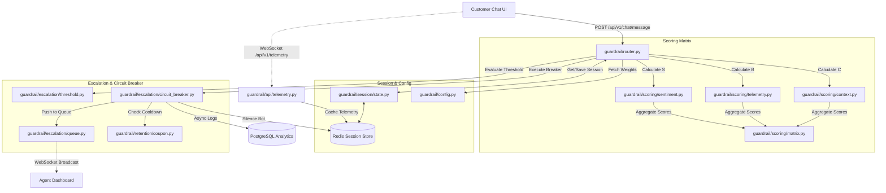

# CalmIQ AI Guardrail Middleware — System Architecture

This document details the internal request routing, components, and data schemas that drive the CalmIQ AI Guardrail Middleware.

---

## System Architecture Diagram

The flowchart below represents the end-to-end request flow, scoring aggregations, session state caching, and circuit breaker escalation routing:

---

## Core Component Modules

### 1. Request Orchestrator (`guardrail/router.py`)
Acts as the central gateway intercepting raw client queries. It loads session details from cache, executes the multi-dimensional scoring modules, computes aggregate irritation, runs hysteresis rules, and branches to either forward the query to LLMs or sever connection.

### 2. Multi-Dimensional Scoring Engine (`guardrail/scoring/`)
- **Linguistic Sentiment (S):** Analyzes words using a local CardiffNLP RoBERTa sentiment classifier (with regex-based lexical fallbacks), calculating CAPS shout ratios, repeated punctuation, trigger keywords, and recent emotional shift speeds.
- **Behavioral Telemetry (B):** Ingests client-side rage clicking and typing velocity anomalies. Includes backend calculations tracking input copy-paste similarities.
- **Conversational Context (C):** Scans active session states to detect loops across AI answers and user messages (weighted 0.4 and 0.6 respectively), applying penalization flags for long unresolved turn counts or repeat complainants.
- **Rebalanced Matrix (`matrix.py`):** Combines S, B, and C scores. In the event of a telemetry outage, it automatically switches weights to a rebalanced degraded mode.

### 3. Session Caching and Data Storage (`guardrail/session/`, `guardrail/storage/`)
- **Redis Connector (`state.py`):** Provides sub-millisecond serialization reads and writes with active TTL limits. It coordinates the WebSocket queue depth. Features process-local memory fallbacks.
- **PostgreSQL Logger (`store.py`):** Standardizes SQL schema tables tracking turn-by-turn chat transactions, peak irritation thresholds, and human transfer events.

### 4. Escalation and Circuit Breaker (`guardrail/escalation/`, `guardrail/retention/`)
- **Hysteresis Engine (`threshold.py`):** Computes customer-specific thresholds (adjusting base threshold for LTV and returning complaints). Tracks continuous breach durations to ensure transient spikes do not flap alerts.
- **Circuit Breaker (`circuit_breaker.py`):** Severing coordinator that silences chatbots, builds live agent context payloads, checks agent queue depths, triggers coupon fraud gates, and logs events.
- **Anti-Fraud Coupon Gate (`coupon.py`):** Applies cooldown windows and duration checks to prevent gamification of discount coupon allocations.
